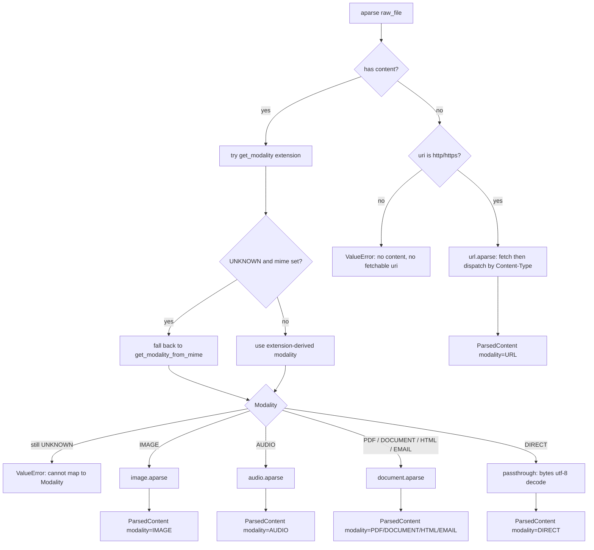
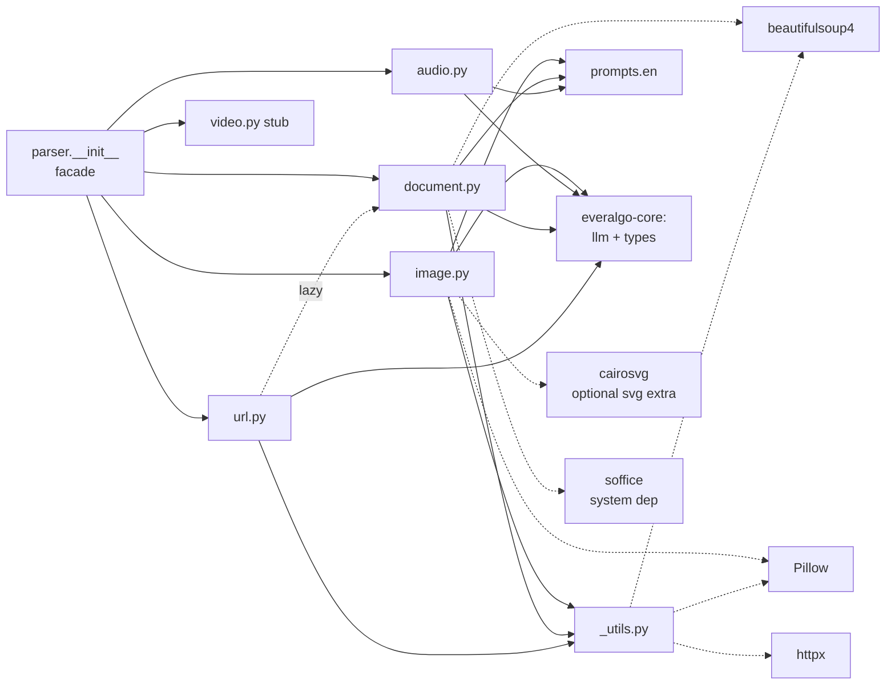
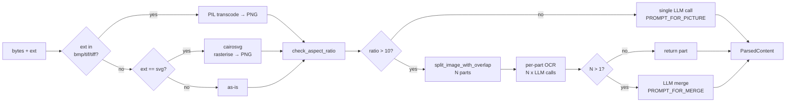
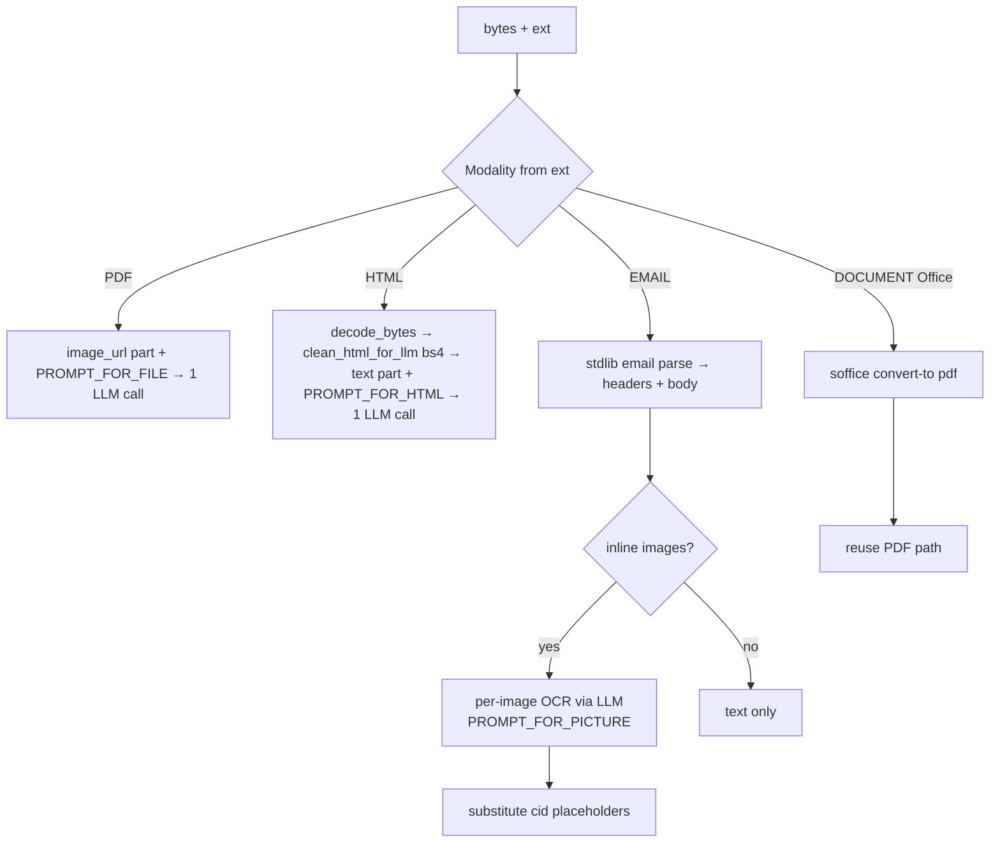
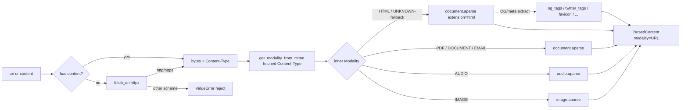

# everalgo-parser — 模块 & 接口图

供 code review 用,展示当前实现的模块边界、调用关系、对外接口、类型契约、依赖拓扑。

GitHub 默认渲染下面的 Mermaid 图。

---

## 1. 包内文件结构

```
packages/everalgo-parser/
├── src/everalgo/parser/
│   ├── __init__.py        ← 顶层 facade:dispatch + re-export 公开类型
│   ├── _utils.py          ← 私有助手:fetch_uri / decode_bytes / aspect-ratio / html-clean
│   ├── image.py           ← IMAGE modality 算子(含长图分块 + BMP/TIFF 转码 + SVG 栅格化)
│   ├── audio.py           ← AUDIO modality 算子
│   ├── document.py        ← PDF / HTML / EMAIL / Office(LibreOffice)四合一
│   ├── url.py             ← URL modality 算子(HTTP 抓取 + OG 抽取 + 委托 HTML)
│   ├── video.py           ← stub,等 ADR
│   └── prompts/
│       ├── __init__.py
│       ├── en/{image,audio,document}.py    ← PROMPT_FOR_{PICTURE,MERGE,AUDIO,FILE,HTML}
│       └── zh/{image,audio,document}.py    ← 中文对偶
├── tests/
│   ├── fixtures/          ← 17 个真实 sample.* 文件
│   └── parser/
│       ├── test_audio.py
│       ├── test_dispatch.py
│       ├── test_document.py
│       ├── test_e2e_all_formats.py
│       ├── test_e2e_pdf_openrouter.py
│       ├── test_image.py
│       ├── test_public_api.py
│       ├── test_url.py
│       ├── test_utils.py
│       └── test_video.py
├── pyproject.toml
├── README.md
└── CHANGELOG.md
```

---

## 2. 公开 API 表面(facade)

`from everalgo.parser import ...` 一处导入,2 个函数 + 3 个类型。

| 符号 | 种类 | 签名 / 说明 |
|---|---|---|
| `aparse` | async fn | `async def aparse(raw_file: RawFile, *, llm: LLMClient \| None = None) -> ParsedContent` |
| `parse` | sync fn | sync 桥接(`asgiref.async_to_sync`),不要在事件循环里调 |
| `RawFile`, `ParsedContent`, `Modality` | type re-export | 来自 `everalgo.types` |

5 个 modality 子模块(`image` / `audio` / `document` / `url` / `video`)是顶层 dispatcher 的内部实现,不在 `__all__` 中;通过 Python attribute lookup 仍可访问,但不是公开承诺(对标 sklearn / numpy 模式)。

---

## 3. 顶层 dispatch 流(`parser.aparse`)



**关键规则**:
- `uri=http(s)://` + `content=b""` → 走 `url.aparse`(内部抓取 + 按 Content-Type 再分派)。
- 已经有 `content`:**extension 优先**,extension 解析不到时**用 mime 兜底**(`get_modality_from_mime`)。这样 design.md §2.1 的 `RawFile(uri=..., mime="application/pdf")` 走 URL 抓取后能再走到 PDF handler。
- 子模块内部派发用 extension(`_MIME_MAP[ext]` 查 mime)。当顶层用 mime 解出 modality 时,自动 `model_copy(extension=get_extension_from_mime(mime))` 给子模块。
- `file://` 在 `_utils.fetch_uri` 里直接拒绝(AGENTS.md §1)。
- `Modality.URL` 是顶层 dispatch 产生的"来源标签",不出现在 extension 派发表里。

---

## 4. 模块依赖图(import 关系)



**说明**:
- `url.py` → `document.py` 是 **lazy import**(写在函数内,避免循环 import)
- 5 个 parser 模块都依赖 `everalgo-core`(LLM 调用 + 类型)
- `cairosvg` 是 `[svg]` extra,延迟 import(只在解析 svg 时触发)
- `soffice` 是**系统包**,运行时 detection(`shutil.which`)

---

## 5. 类型契约

### `RawFile`(输入)

| 字段 | 类型 | 默认 | 说明 |
|---|---|---|---|
| `content` | `bytes` | `b""` | 文件 bytes。可选,但 `content` / `uri` 至少有一个 |
| `mime` | `str` | `""` | MIME hint,如 `application/pdf` |
| `extension` | `str` | `""` | 不带点小写扩展名,如 `pdf`,**派发依据** |
| `uri` | `str` | `""` | `http`/`https` 才会被抓取;`file://` 拒绝 |

### `ParsedContent`(输出)

| 字段 | 类型 | 说明 |
|---|---|---|
| `text` | `str` | 提取后的主文本(Markdown / 纯文本) |
| `modality` | `Modality` | 来源分类 |
| `mime` | `str` | 源 MIME(无则空串) |
| `metadata` | `dict[str, Any]` | 按模态填:`model` / `finish_reason` / `tall_image_parts` / `inline_image_ocr` / `og_tags` / `intermediate_pdf_bytes` 等 |

### `Modality` 枚举(StrEnum,9 值)

```
IMAGE  PDF  AUDIO  DOCUMENT  HTML  EMAIL  URL  DIRECT  UNKNOWN
```

`get_modality(ext: str) -> Modality` 派发函数 + `EXTENSION_TO_MODALITY` 映射,都在 `everalgo-core/types/modality.py`。

---

## 6. 各 modality 调用链

### 6.1 IMAGE(`image.aparse`)



### 6.2 DOCUMENT(`document.aparse`)



### 6.3 AUDIO(`audio.aparse`)

```
RawFile.content (mp3/wav/m4a/...) → image_url data URI + PROMPT_FOR_AUDIO → 1 LLM call → ParsedContent.text
```

### 6.4 URL(`url.aparse`)



**关键规则**:
- 抓回来的 Content-Type **驱动 inner dispatch**。`application/pdf` → PDF handler;`image/png` → image handler;`audio/mpeg` → audio handler;`text/html` 或未知 → HTML handler(兜底)。
- **OG / Twitter / `<meta>` 抽取仅 HTML 响应做** —— 非 HTML 响应的 `ParsedContent.metadata` 不带 `og_tags` / `title` 等字段。
- 返回的 `modality` 永远是 `Modality.URL`,真实的 inner 类型放在 `metadata["inner_modality"]`,调用方既能知道"这是从网络来的",也能知道"实际是 PDF"。

---

## 7. 依赖拓扑

### Pip 依赖(`pyproject.toml`)

| 依赖 | 用途 | 何时拉 |
|---|---|---|
| `everalgo-core` | LLM 客户端 + 公共类型 + fake_llm | 必装 |
| `asgiref` | sync 桥接(`async_to_sync`)| 必装 |
| `pillow` | image 转码 + 长图分块 | 必装 |
| `beautifulsoup4` | HTML 清洗 + URL OG 抽取 | 必装 |
| `httpx` | URL HTTP 抓取 | 透传(`everalgo-core` 已经依赖 openai SDK 拉了) |
| `cairosvg` | SVG 栅格化 | `pip install 'everalgo-parser[svg]'` 才装 |

### 系统依赖

| 程序 | 用途 | 检测 |
|---|---|---|
| `soffice`(LibreOffice)| Office 文档转 PDF | `shutil.which("soffice")` + macOS `/Applications/LibreOffice.app/Contents/MacOS/soffice` |

---

## 8. 测试覆盖

| 文件 | 数量 | 类型 | LLM |
|---|---|---|---|
| `test_public_api.py` | 2 | 公开 API 形状 | 不用 |
| `test_dispatch.py` | 25 | 顶层派发 | `FakeLLMClient` |
| `test_image.py` | 12 | PIL 路径 + 长图分块 / 合并 | `FakeLLMClient` |
| `test_audio.py` | 5 | audio 子模块 happy + error path | `FakeLLMClient` |
| `test_document.py` | 12 | PDF / HTML / EML 单测 | `FakeLLMClient` |
| `test_url.py` | 21 | OG 抽取 + httpx mock | `FakeLLMClient` + `respx` |
| `test_utils.py` | 18 | `_utils` 助手(no LLM,no network)| 不用 |
| `test_video.py` | 2 | video stub NotImplementedError | 不用 |
| `tests/types/test_modality.py` | 12 | Modality enum + get_modality | 不用 |
| `tests/types/test_parsed.py` | 3 | ParsedContent 字段 | 不用 |
| `test_e2e_all_formats.py` | 7 | 全格式 e2e | 真 LLM(env `OPENROUTER_API_KEY`)|
| `test_e2e_pdf_openrouter.py` | 1 | PDF spike e2e | 真 LLM(env `OPENROUTER_API_KEY`)|

**测试总数**:`391`(parser+core)/`923`(workspace 全量)
**E2E**(需 `OPENROUTER_API_KEY`):`8`(`test_e2e_all_formats.py` 7 + `test_e2e_pdf_openrouter.py` 1)

---

## 9. 公开规范契约

| 规范 | 对应 |
|---|---|
| `a` 前缀代表 async | ✅ `aparse` async / `parse` sync 桥接(ADR-010) |
| Protocol over ABC | ✅ 没有 `ABC` 基类,LLMClient 是 Protocol(ADR-011) |
| 无 retry / fallback / metrics | ✅ 算法层不做工程高可用(ADR-012) |
| 无状态(不读文件系统) | ✅ 接 `bytes` / HTTP,`file://` 拒绝(AGENTS.md §1) |
| 懒 `%`-format 日志 | ✅ `logger.debug("count=%d", n)` 风格(ADR-013) |
| Prompt = `prompts/{en,zh}/<name>.py` 模块常量 | ✅ |
| Numpy-style docstring | ✅ |
| 英文 docstring / 标识符 / commit | ✅(docs/ 下 design.md 例外,中文 OK) |

---

## 10. 已知未实现 / 推迟

| 项 | 状态 | 备注 |
|---|---|---|
| `video.py` | stub | 上游 evermemos-multimodal **也没有**实现,Gemini Video vs Whisper+帧抽取 选型待 ADR |
| `audio` BMP-like 转码 | 没做 | mp3/wav 测过;m4a/amr/aiff/aac/ogg/flac 未在 e2e 覆盖,Gemini 兼容度未全测 |
| `Office` 系统依赖动态检测降级 | 仅运行时报错 | 没有 import 时友好警告;`_find_soffice` 缺失就 `RuntimeError` |
| `T1` 主条目其他 schema | 待 RESOLVED | 我们只 RESOLVED 了 `T1.parser` 子集(`ParsedContent` / `Modality` / `RawFile`) |
